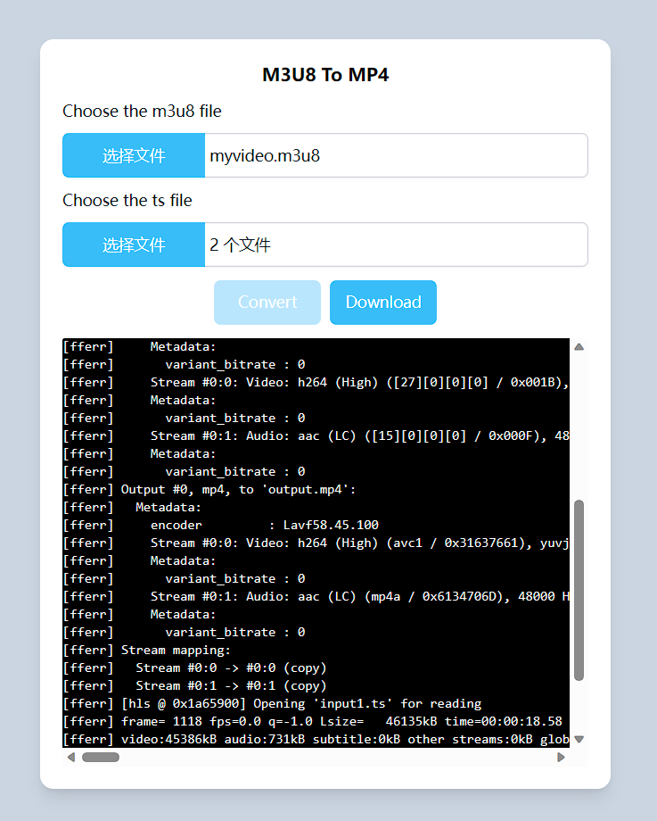
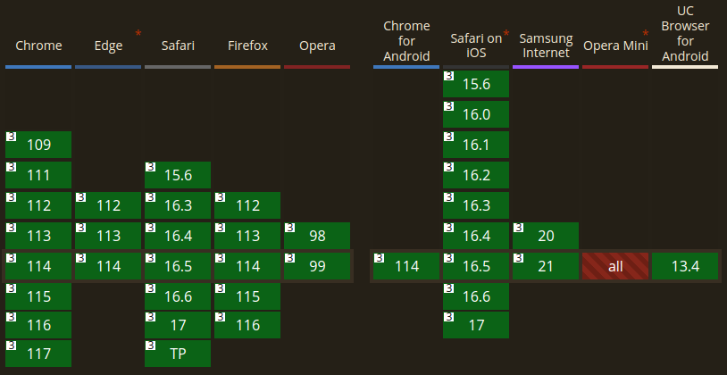

# VidConvert
video convert with wasm

online: https://blog.greycode.top/VidConvert/

## supported browser version

ffmpeg -hide_banner -i VID_20230626_095923.mp4 -i kbs-logo.svg -filter_complex "[1:v] scale=176:40 [logo];[0:v][logo]overlay=x=W-w:y=10" out.mp4